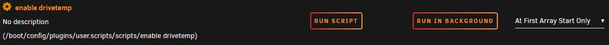
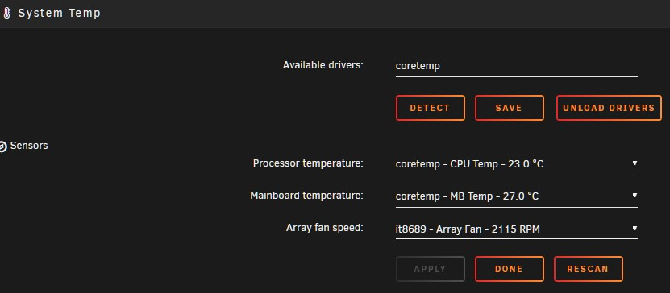
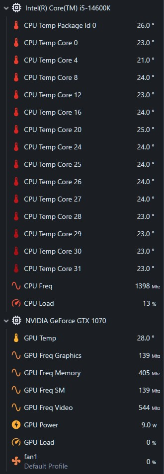
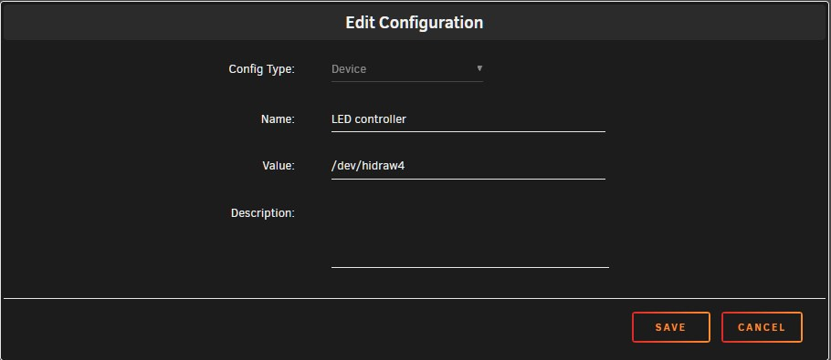
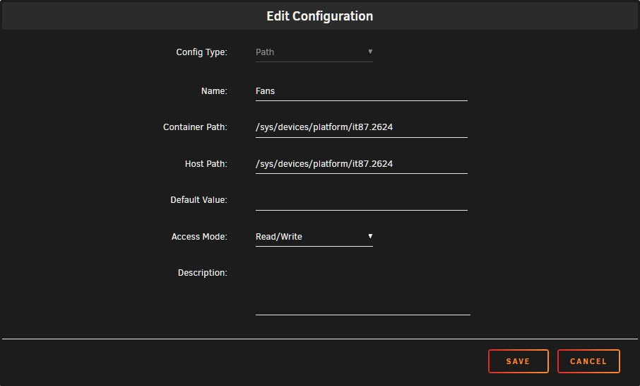
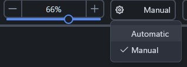
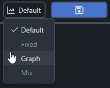

# Setting up CoolerControl in Unraid

Setting up CoolerControl in Unraid is fairly straightforward but does require a little manual work to make sure it's working correctly. This tutorial will walk through setting it up.

## Table of Contents

- [Prerequisites](#prerequisites)
  - [Enabling hard drive temperature reporting](#enabling-hard-drive-temperature-reporting)
  - [Confirm fans are visible to Unraid](#confirm-fans-are-visible-to-unraid)
  - [Nvidia GPU support](#nvidia-gpu-support)
- [Initial CoolerControl setup](#initial-coolercontrol-setup)
  - [Adding Nvidia GPUs](#adding-nvidia-gpus)
  - [Privileged mode](#privileged-mode)
- [Checking devices in CoolerControl](#checking-devices-in-coolercontrol)
  - [Checking devices for hwmon](#checking-devices-for-hwmon)
  - [Example: adding an LED controller](#example-adding-an-led-controller)
  - [Example: adding fan controls](#example-adding-fan-controls)
  - [Finalizing device setup](#finalizing-device-setup)
- [Configuring CoolerControl](#configuring-coolercontrol)
  - [Identify and name devices](#identify-and-name-devices)
  - [Setting up a profile](#setting-up-a-profile)
  - [Combining sensors to create a custom sensor](#combining-sensors-to-create-a-custom-sensor)
- [Troubleshooting](#troubleshooting)
  - [Controlling Nvidia GPU fans](#controlling-nvidia-gpu-fans)
  - [Issues with Nvidia powersaving](#issues-with-nvidia-powersaving)
  - ["Unable to set PWM Value" and/or fan not staying on curve](#unable-to-set-pwm-value-andor-fan-not-staying-on-curve)
  - [Could not connect to DBUS](#could-not-connect-to-dbus)
  - [Slow HWMon Device detected](#slow-hwmon-device-detected)
- [Known issues](#known-issues)
  - [Hard drive spin down temperatures](#hard-drive-spin-down-temperatures)

## Prerequisites

There is some setup required to get the full functionality of CoolerControl on Unraid.

### Enabling hard drive temperature reporting

CoolerControl relies on the [Linux Hardware Monitoring kernel API](https://docs.kernel.org/hwmon/hwmon-kernel-api.html) (hwmon) to collect information like sensor temperatures from the system. By default, SATA devices like hard drives do not have their temperatures reported to hwmon. Enabling this in Unraid is simple: open the Unraid terminal and enter the command `sudo modprobe drivetemp`. 

This command has to be run every time the system is rebooted. To do this, use the User Scripts plugin from Andrew Zawadzki. In User Scripts, add a new script, and then edit the script to include that command:

  
  

Save the script, and then edit the schedule for the script to run on first array start.

  
  

### Confirm fans are visible to Unraid

To check if fans are already visible to Unraid, install the __Dynamix System Temp plugin from Bergware.__ In the settings for this plugin, it is possible to select which fan is shown on the Unraid dashboard footer.

  
  

If no fans are available under the _Array fan speed_ menu, it means the system fans are not currently visible to Unraid.

A potential fix for this is drivers from Community Applications. The __ITE IT87 Driver from ich777__ has worked for others in making the fans available. The __Nuvoton NCT6687 Driver from ich777__ may also work.

### Nvidia GPU support

To add Nvidia GPUs to CoolerControl, the __Nvidia-Driver plugin__ from Community Applications needs to be installed and the plugin must be used to install a Nvidia driver on the system.

If these are installed, Nvidia GPUs will be able to show up in CoolerControl. See the [Nvidia section below](#adding-nvidia-gpus) for information on how to set this up.

If using the [Nvidia powersaving script by SpaceInvaderOne](https://github.com/SpaceinvaderOne/nvidia_powersave) it may interfere with this container. See the [Issues with Nvidia powersaving](#issues-with-nvidia-powersaving) section below for how to fix this. 

## Initial CoolerControl setup

Search for _CoolerControl_ in Community Applications and select _Install._

The Unraid template has three settings by default: the configuration storage, the WebUI port, and read-only access to hwmon on the Unraid system.

  
  

The CoolerControl configuration host path can be changed to store it somewhere else if needed, and the port can be changed if it conflicts with another container.

### Adding Nvidia GPUs

> [!IMPORTANT]  
> There is currently no way to control Nvidia GPU fans without leaving the container in privileged mode, and it is not recommended to leave the container in privileged mode.

To add Nvidia GPUs to CoolerControl, change _Basic View_ to _Advanced view_ in the top right of the _Add Container_ or _Update Container_ page when configuring the container.

  
  

Next, edit the _Extra Parameters_ section to add `--runtime=nvidia --gpus=all`.

  
  

If using the [Nvidia powersaving script by SpaceInvaderOne](https://github.com/SpaceinvaderOne/nvidia_powersave) it may interfere with this container. See the [Issues with Nvidia powersaving](#issues-with-nvidia-powersaving) section below for how to fix this. 

### Privileged mode

> [!IMPORTANT]  
> It is not recommended to leave the container in privileged mode, and it should be disabled after setup of the container has been finished.

While following this tutorial and while performing initial setup on the container, run it in privileged mode. This gives the container unrestricted access to the Unraid system, which will allow CoolerControl to discover any available devices on the system. 

  
  

Hit apply to download and run the container.

## Checking devices in CoolerControl

Now that CoolerControl is running, go to Unraid's Docker tab and click on the icon next to CoolerControl, and click on _WebUI_ to open CoolerControl itself.

  
  

On first run, CoolerControl will walk through a basic introduction of how to use it.

  
  

After this introduction, check the devices that are available in CoolerControl. Each device should have a variety of sensors for temperature, frequency, load, power, and more.

  
  

### Checking devices for hwmon

Check each device to see if it's being exposed by hwmon, which is already mounted to the container. The CPU sensors should be provided by hwmon. Click on the ⓘ next to the device (labeled _Device Details_) and look at the locations.

  
  

The first location is `/sys/class/hwmon/hwmon2` which is being mounted to the container under hwmon. This means that this device is already being provided to the container regardless of whether privilged mode is on or not.

Check each device and see if it is being provided by hwmon by checking under _Locations_.

### Example: adding an LED controller

In this example system, CoolerControl is also discovering an LED controller built into the motherboard. 

  
  

Under locations, the LED controller is identified at `/dev/hidraw4`. Because it is not provided by hwmon, it needs to be manually added to the container in Unraid. Return to the docker tab of Unraid and edit the container.

  
  

In the Update Container screen, scroll to the bottom and select _Add another Path, Port, Variable, Label, or Device._ In the _Add Configuration_ menu, set the _Config Type_ to _Device_, because the device is located in `/dev`, which means it is a device. Add the path listed in CoolerControl, and name the device accordingly.

  
  

Save this configuration and apply it to the container. This will update the container so that the LED controller will show up even if privileged mode is turned off.

### Example: adding fan controls

On CoolerControl, find the device that is exposing the fans to the container. In this example, the fans are exposed under _it8689_. Notice that the locations does include hwmon.

  
  

However, because hwmon is mounted as read-only in the container, the fan speed can not be controlled if the container is not run in privileged mode. To get around this, the fan directory can be directly mounted in the Unraid container with read-write permissions. Return to the docker tab of Unraid and edit the container.

  
  

In the _Update Container_ screen, scroll to the bottom and select _Add another Path, Port, Variable, Label, or Device._ In the _Add Configuration_ menu, keep the _Config Type_ on _Path_. Add the second path listed in CoolerControl's locations, and name the device accordingly.

  
  

Save this configuration and apply it to the container. This will update the container so that the fans are controllable even if privileged mode is turned off.

### Finalizing device setup

Once the devices have been checked and set up in the Unraid _Update container_ screen, edit the container a final time to turn off privileged mode. Once privileged mode is off, open CoolerControl and check that all of the devices still appear, and that devices like fans can be controlled. Fans can be checked by setting them to manual and adjusting the fan speed.

  
  

If no error appears when applying the new fan speed, the configuration is working.

> [!IMPORTANT]  
> There is currently no way to control Nvidia GPU fans without leaving the container in privileged mode, and it is not recommended to leave the container in privileged mode.

## Configuring CoolerControl

### Identify and name devices

In CoolerControl, start by identifying fans by manually spinning them up and down. Then, give them a recognizable name by clicking on the rename button (🖉).

  
  

The hard drives can also be named. Compare the temperature on the Unraid dashboard to the temperature in CoolerControl and name them accordingly, e.g. Parity, Disk 1, etc.

### Setting up a profile

In CoolerControl, find profiles, found above the devices and sensors, and hit _Add Profile._

  
  

Rename the profile appropriately, i.e. _CPU Profile_ for a profile that will be used for cooling the CPU. 

Next, edit the profile in the top right of the screen to choose the type of profile. This guide will focus on using a graph for the profile.

  
  

Next, select a temperature sensor source for the profile. Since this example is for the CPU, this profile will use the CPU Temp Package Id 0.

  
  

CoolerControl by default applies a simple graph that increases the fan speed between 20°C to 100°C. 

Next, apply the profile to a fan. Select an appropriate fan and change the profile in the top right from _Default Profile_ to the profile created.

  
  

After saving, the fan speed should now follow the curve set in the profile. Return to the profile and adjust the points on the graph until it fits the server's cooling needs. It is also possible to have a fan not run until a particular temperature is hit.

### Combining sensors to create a custom sensor

CoolerControl only allows one sensor to be set per profile, but it is possible to combine sensors to create one custom sensor. In this tutorial, the average of multiple hard drive temperatures will be combined into a custom sensor

First, select the _Add Custom Sensor_ button next to Custom Sensors, found above the devices and sensors.

  
  

Next, to make a sensor that is based on the averages of these temperatures, select _Avg_ under _Mix Function._ Depending on how the system's hard drives are physically organized, it may be better to have the _Mix Function_ be based on _Max_, which will use the sensor that has the highest temperature.

  
  

Finally, under _Temp Sources_ select sensors that will be used for this custom sensor, and hit _Save Sensor_ in the top left. CoolerControl will do a quick reboot to make the new sensor.

  
  

This sensor can now be used in a profile.

## Troubleshooting

### Controlling Nvidia GPU fans

There is currently no way to control Nvidia GPU fans without leaving the container in privileged mode, and it is **not recommended to leave the container in privileged mode.**

### Issues with Nvidia powersaving

The [Nvidia powersaving script by SpaceInvaderOne](https://github.com/SpaceinvaderOne/nvidia_powersave) will stop the coolercontrold process used by this container if no other Docker containers are using the GPUs. To fix this, use [this revised script](https://github.com/guniv/CoolerControl-Docker/blob/main/tutorial/nvidia_power.sh) that specifically carves out an exception for coolercontrold.

### "Unable to set PWM value" and/or fan not staying on curve

If CoolerControl is encountering this error or the fans won't stay at a speed to match the set curve, the system's BIOS settings may be interfering with CoolerControl. The fix will vary from BIOS to BIOS but it is recommended to set the system fans at full speed in the system BIOS.

### Could not connect to DBUS

The "Could not connect to DBUS" error is normal when running in a Docker container. This feature is normally used by CoolerControl to check whether the system is sleeping, which will not happen with a Docker container. This error can be safely ignored.

### Slow HWMon Device detected 

The "Slow HWMon Device detected" error may be detected when Unraid spins disks down depending on your settings. This error can usually be safely ignored but may require your attention in some scenarios.

## Known issues

### Hard drive spin down temperatures

At the moment, the last known temperature of a hard drive being reported to hwmon by drivetemp that has been spun down will only report the last known temperature of the device. This may impact a configuration that has a curve based on the drive speeds. For instance, fans could continue to run at a high speed if the drive spins down while running warm. 
