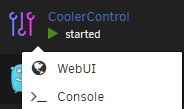

# Setting up CoolerControl in Unraid

Setting up CoolerControl in Unraid is fairly straightforward but does require a little manual work to make sure it's working correctly. This tutorial will walk through setting it up.

## Table of Contents

- [Prerequisites](#prerequisites)
  - [Enabling hard drive temperature reporting](#enabling-hard-drive-temperature-reporting)
  - [Confirm fans are visible to Unraid](#confirm-fans-are-visible-to-unraid)
  - [Nvidia GPU support](#nvidia-gpu-support)
- [Initial CoolerControl setup](#initial-coolercontrol-setup)
  - [Adding Nvidia GPUs](#adding-nvidia-gpus)
  - [Privileged mode](#privileged-mode)
- [Checking devices in CoolerControl](#checking-devices-in-coolercontrol)
- [Configuring CoolerControl](#configuring-coolercontrol)


## Prerequisites

There is some setup required to get the full functionality of CoolerControl on Unraid. Community Applications needs to be installed on the server for CoolerControl and this setup.

### Enabling hard drive temperature reporting

CoolerControl relies on the [Linux Hardware Monitoring kernel API](https://docs.kernel.org/hwmon/hwmon-kernel-api.html) (hwmon) to collect information from the system like sensor temperatures. By default, SATA devices like hard drives do not have their temperatures reported to hwmon. Enabling it in Unraid is simple: open the Unraid terminal and enter the command ```sudo modprobe drivetemp```. 

This command has to be run every time the system is booted. To do this, use the User Scripts plugin from Andrew Zawadzki. In User Scripts, add a new script, and then edit the script to include that command:

<p align="center">  
  
</p>

Save the script, and then edit the schedule for the script to run on first array start.

<p align="center">  
  
</p>

### Confirm fans are visible to Unraid

To check if fans are already visible to Unraid, install the Dynamix System Temp plugin from Bergware. In the settings for this plugin, it is possible to select which fan is shown on the Unraid dashboard footer.

<p align="center">  
  
</p>

If no fans are available under the ```Array fan speed``` menu, it means the system fans are not currently visible to Unraid.

A potential fix for this is drivers from Community Applications. The ITE IT87 Driver from ich777 has worked for others in making the fans available. The Nuvoton NCT6687 Driver from ich777 may also work.

### Nvidia GPU support

To add Nvidia GPUs to CoolerControl, the Nvidia-Driver plugin from Community Applications needs to be installed and the plugin must be used to install a Nvidia driver on the system.

If these are installed, Nvidia GPUs will be able to show up in CoolerControl. See the [Nvidia section below](#adding-nvidia-gpus) for information on how to set this up.

## Initial CoolerControl setup

The Unraid template has three settings by default: the configuration storage, the WebUI port, and read-only access to hwmon on the Unraid system.

<p align="center">  
  
</p>

The CoolerControl configuration host path can be changed to store it somewhere else if needed, and the port can be changed if it conflicts with another container.

### Adding Nvidia GPUs

To add Nvidia GPUs to CoolerControl, change ```Basic View``` to ```Advanced view``` in the top right of the ```Add Container``` or ```Update Container``` page when configuring the container.

<p align="center">  
  
</p>

Next, edit the ```Extra Parameters``` section to add ```--runtime=nvidia --gpus=all```.

<p align="center">  
  
</p>

### Privileged mode

Finally, while following this tutorial and performing initial setup on the container, run it in privileged mode. This gives the container unrestricted access to the Unraid system, which will allow Coolercontrol to discover any available devices on the system. 

<p align="center">  
  
</p>

Hit apply to download and run the container.

> [!IMPORTANT]  
> It is not recommended to leave the container in privileged mode, and it should be disabled after setup of the container has been finished.

## Checking devices in CoolerControl

Now that CoolerControl is running, go to Unraid's Docker tab and click on the icon next to CoolerControl, and click on WebUI to open CoolerControl itself.

<p align="center">  
  
</p>

On first run, CoolerControl will walk through a basic introduction of how to use it.

<p align="center">  
  
</p>

After this introduction, check the devices that are available in CoolerControl. Each device should have a variety of sensors for temperature, frequency, load, power, and more.

<p align="center">  
  
</p>

### Checking devices for hwmon

Check each device to see if it's being exposed by hwmon, which is already mounted to the container. The CPU sensors should be provided by hwmon. Click on the ⓘ next to the device (labeled ```Device Details```) and look at the locations.

<p align="center">  
  
</p>

The first location is ```/sys/class/hwmon/hwmon2``` which is being mounted to the container under hwmon. This means that this device is already being provided to the container regardless of whether privilged mode is on or not.

Check each device and see if it is being provided by hwmon by checking under Locations.

### Example: adding an LED controller

In this example system, CoolerControl is also discovering an LED controller built into the motherboard. 

<p align="center">  
  
</p>

Under locations, the LED controller is identified at ```/dev/hidraw4```. Because it is not provided by hwmon, it needs to be manually added to the container in Unraid. Return to the docker tab of Unraid and edit the container.

<p align="center">  
  
</p>

In the Update Container screen, scroll to the bottom and select ```Add another Path, Port, Variable, Label, or Device.``` In the ```Add Configuration``` menu, set the ```Config Type``` to device, because the device is located in ```/dev```, which means it is a device. Add the path listed in CoolerControl, and name the device accordingly.

<p align="center">  
  
</p>

Save this configuration and apply it to the container. This will update the container so that the LED controller will show up even if privileged mode is turned off.

### Example: adding fan controls

On CoolerControl, find the device that is exposing the fans to the container. In this example, the fans are exposed under ```it8689```. Notice that the locations does include hwmon.

<p align="center">  
  
</p>

However, because hwmon is mounted as read-only in the container, the fan speed can not be controlled if the container is not run in privileged mode. To get around this, the fan directory can be directly mounted in the Unraid container with read-write permissions. Return to the docker tab of Unraid and edit the container.

<p align="center">  
  
</p>

In the ```Update Container``` screen, scroll to the bottom and select ```Add another Path, Port, Variable, Label, or Device.``` In the ```Add Configuration``` menu, keep the ```Config Type``` on path. Add the second path listed in CoolerControl's locations, and name the device accordingly.

<p align="center">  
  
</p>

Save this configuration and apply it to the container. This will update the container so that the fans are controllable even if privileged mode is turned off.

### Finalizing device setup

Once the devices have been checked and set up in the Unraid docker ```Update container``` screen, edit the container a final time to turn off privileged mode. Once privileged mode is off, open CoolerControl and check that all of the devices still appear, and that devices like fans can be controlled. Fans can be checked by setting them to manual and adjusting the fan speed.

<p align="center">  
  
</p>

If no error appears when applying the new fan speed, the configuration is working.

> [!IMPORTANT]  
> There is currently no way to control Nvidia GPU fans without leaving the container in privileged mode, and it is not recommended to leave the container in privileged mode.

## Configuring CoolerControl

Identify and name devices
Creating a profile
Assigning a fan to a profile
Creating a custom sensor for HDDs
